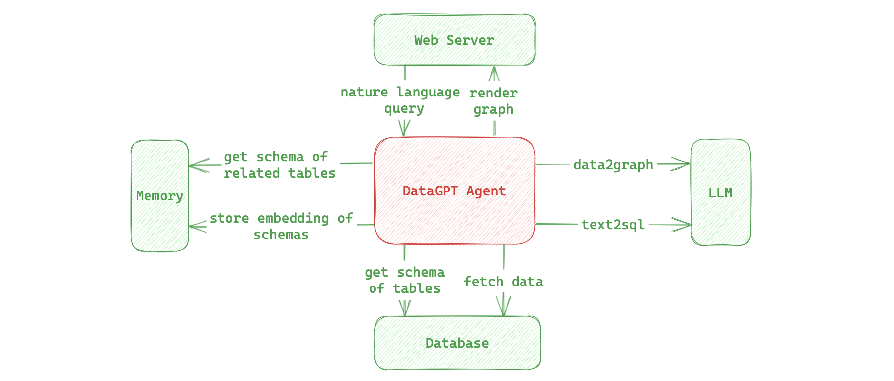

# DataGPT

DataGPT is a compact yet complete AI Agent that allows users to input queries in natural language. It attempts to understand the user's intent, retrieves relevant data from a database, generates corresponding charts, and provides feedback to the user through a web interface. The goal of this project is to make data querying and visualization more straightforward and intuitive.



## Design Principles

- Keep the code as simple as possible for easy understanding and modification.

- Reflect the concept of an AI Agent, utilizing AI to accomplish complex tasks.

## Key Features

- Natural Language Queries: Users can express their queries in natural language, eliminating the need to write complex query statements.

- Data Visualization: DataGPT can generate various types of charts, including bar charts, line charts, pie charts, and more to better represent the data.

- Web Interface: Users can interact with DataGPT through a simple web interface, input queries, and view the generated charts.

## TODO

- [ ] Root Cause Analysis: Automatically search for root causes from the database in response to user-posed questions.

- [ ] Data Insight: Actively mine information from the database based on user-posed guiding questions.

- [ ] Interactive Enhancement: Supports interactive multi-turn question-and-answer interactions, increasing tolerance for questions.

- [ ] Chart Optimization: Enhance and optimize the controllability of chart generation.

- [ ] Database Adaptation: Support a wider range of relational databases and data warehouses.

## Installation and Configuration

1. Clone the repository to your local machine:

   ```bash
   git clone https://github.com/digai-co/DataGPT.git
   cd DataGPT
   ```

2. Create and activate a virtual environment (optional but recommended):

   ```bash
   python -m venv venv
   source venv/bin/activate
   ```

3. Install dependencies:

   ```bash
   pip install -r requirements.txt
   ```

4. Using [docker](https://docs.docker.com/engine/install/) to quick create db and import sample data (optional):
   ```
   # postgresql
   sh examples/db/run_pg.sh
   ```
   ```
   # mysql
   sh examples/db/run_mysql.sh
   ```

5. Edit config file based on your openai and database information:

   ```yaml
   llm:
     openai:
       api_base: # https://api.openai.com/v1 or your azure api base
       api_key: # your api key
       api_model: # gpt-3.5-turbo

    database:
      type: postgresql # support postgresql and mysql now
      uri: postgresql://postgres:@localhost:5432/datagpt # database uri

    memory:
      dir: data  # long-term memory directory
      schema_file: schema # schema cache file
   ```
6. Run the application:

   ```bash
   python server/app.py
   ```

7. Access the web interface: Open a web browser and visit url to use DataGPT.

## Usage Example

1. Open the web interface and input your query request.

2. DataGPT will parse your request, extract relevant data from the database, and generate corresponding charts.

3. View the generated charts, and you can download them to share with others.

## Troubleshooting

### Issue: What should I do if the schema information in memory becomes outdated?
**Solution:** If you find that the schema information in memory has become outdated, you can take the following steps to update it:

1. Delete the cache files in the data subdirectory located in the project's root directory. You can remove the cache files using the following command:
    ```bash
    rm -rf data/*
    ``````
2. Restart the application to ensure it uses the latest schema information:
    ```bash
    python server/app.py
    ```

## Contributing

If you wish to contribute to the project, you can:

- Participate in development by submitting pull requests, especially the features in TODO list.

- Raise issues and provide suggestions to help us improve the project.

## License

This project is licensed under the [MIT License](LICENSE.md).

## Author

DataGPT is created and maintained by [DigAI.co TEAM](https://digai.co), including Daoguo Dong, Tao Wang, and more...


